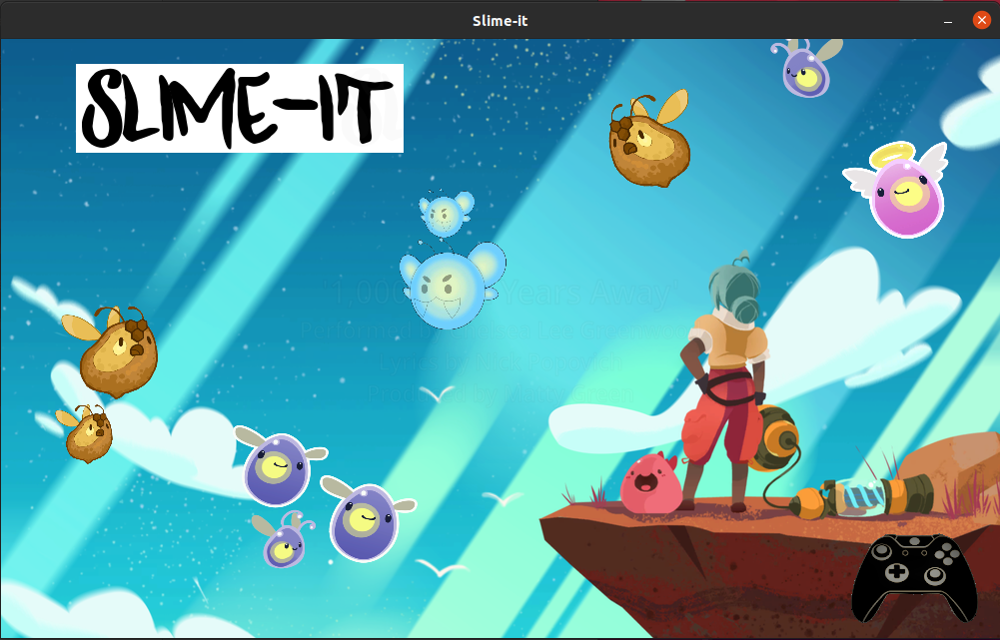
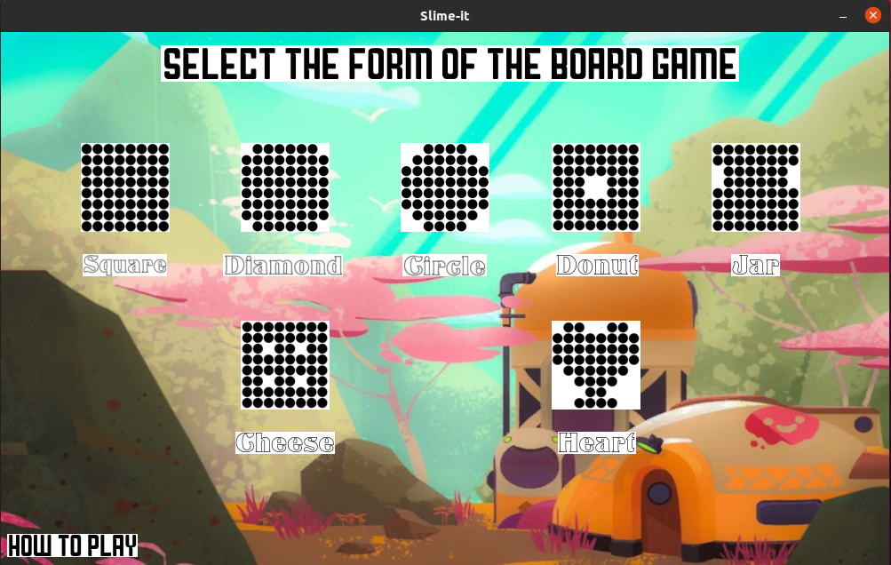
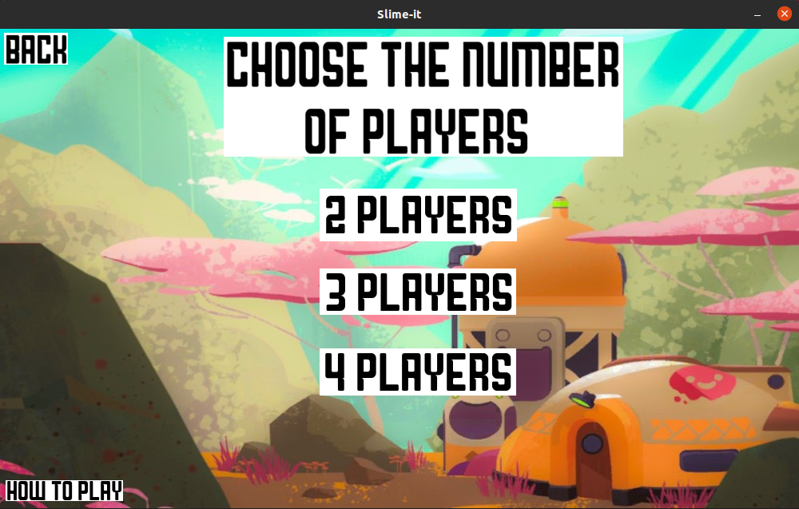
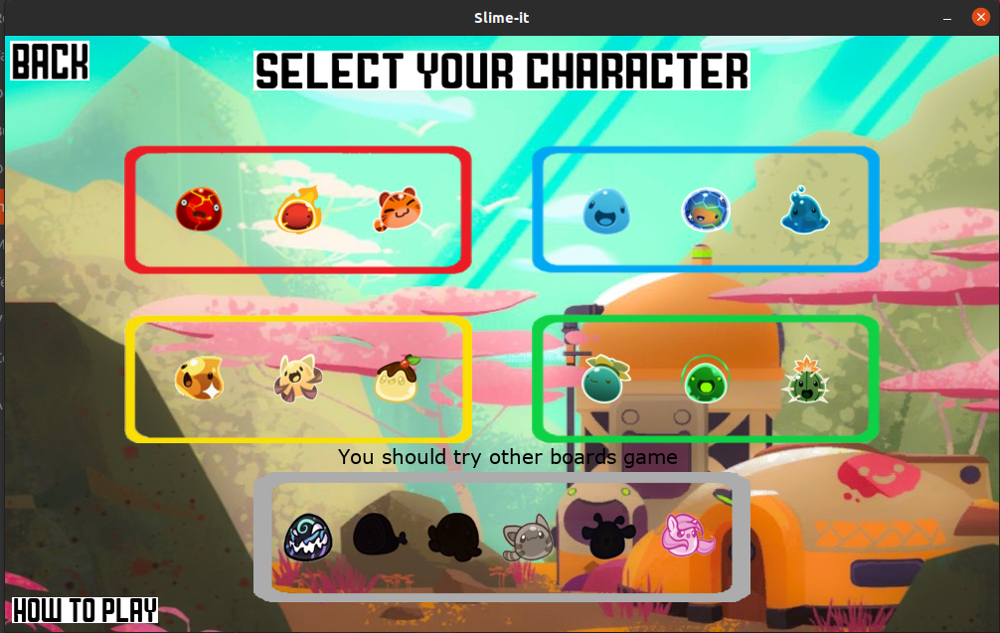
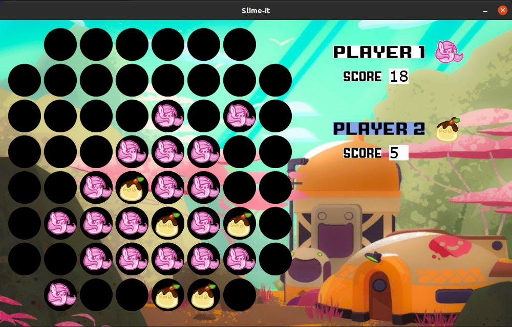
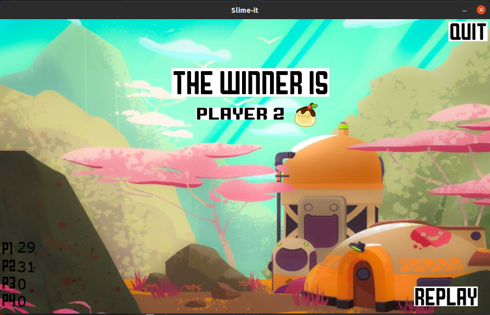

# Slime-it
I recreated the board game "Rol-it" in python3 and Pygame.

  
  
  
  
  
  

## What's Rol-it ?
It's a family board game, you can play with up to 4 players.
In this game you must dominate the board game with your color.
For this, you have to surround the oponent's paws with yours.
The game end when all the cases of the board are filled.

I made this project in 2020 in 4days.

Thanks for looking this project and don't hesitate to star this repo! 😊